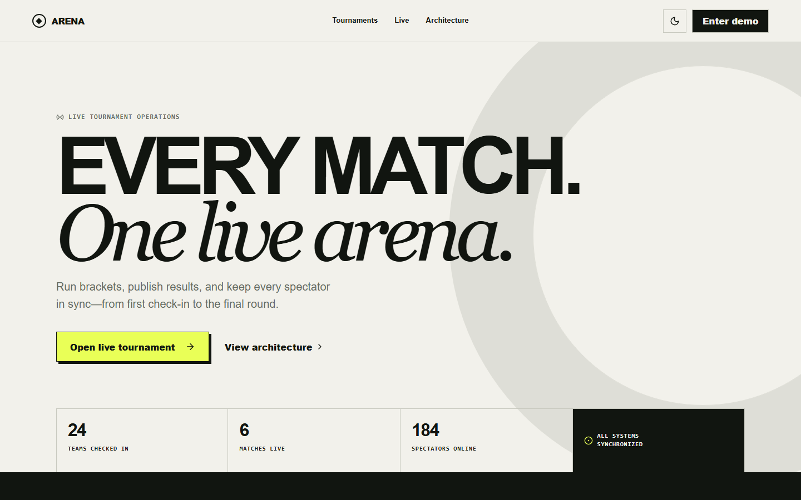
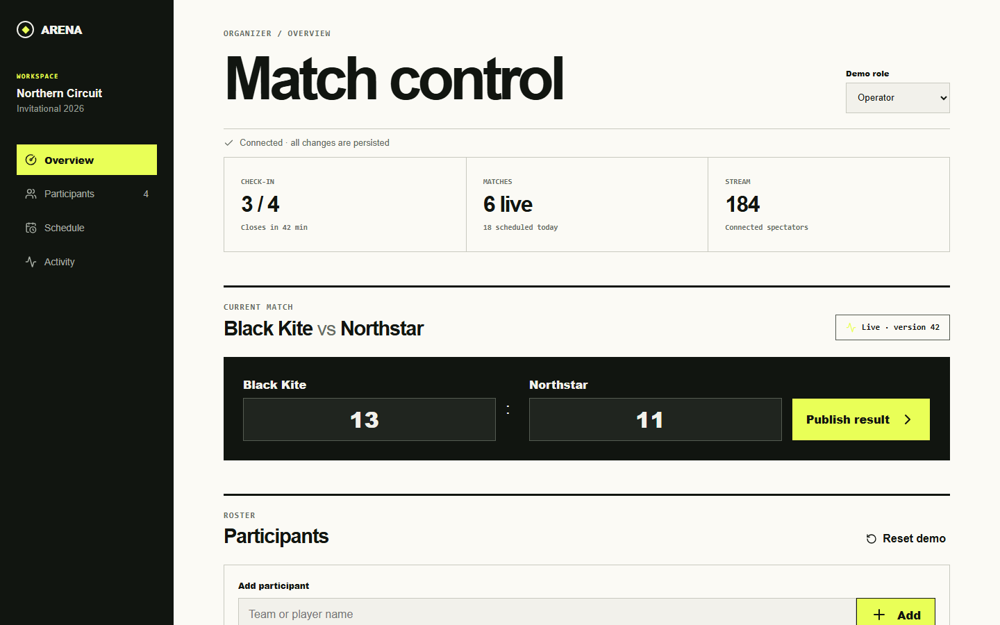
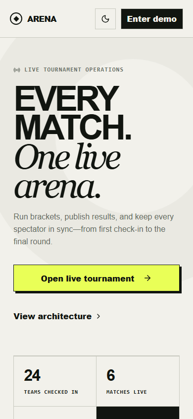
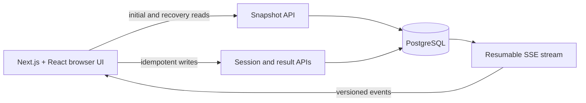

# Arena

**A production-minded real-time tournament platform demo.** Operators publish authoritative match results while spectators stay synchronized through a resumable Server-Sent Events stream.

[](https://github.com/fsaidad/arena/actions/workflows/quality.yml)
[](https://arena-production-0615.up.railway.app)
[](https://nextjs.org/)
[](https://www.postgresql.org/)

[Open the live demo](https://arena-production-0615.up.railway.app) · [Organizer workspace](https://arena-production-0615.up.railway.app/organizer) · [Technical design](docs/architecture.md)



## The portfolio proof

Arena demonstrates one complete, failure-aware product loop:

1. An operator opens an opaque demo session with a server-enforced role.
2. A result mutation carries an idempotency key and expected aggregate version.
3. PostgreSQL commits the match update, event-log entry, and audit record together.
4. Spectators receive the versioned event over SSE.
5. A disconnected or stale client keeps the last confirmed state, reconnects, and resynchronizes from a snapshot when needed.

This is a focused demo, not a static concept page: the public UI, organizer controls, API, event stream, database, migrations, CI, and deployment are connected end to end.

## Product tour

| Spectator experience | Organizer workspace |
| --- | --- |
| Live score, bracket context, connection freshness, offline simulation, theme switching, and keyboard access. | Viewer/Operator/Admin demo roles, optimistic result publishing, version feedback, persisted state, and a safe local roster sandbox. |



<details>
<summary>Mobile layout</summary>



</details>

## Engineering highlights

- **Versioned realtime contract:** ordered envelopes, duplicate rejection, gap detection, snapshot recovery, and exponential reconnect backoff.
- **Mutation integrity:** optimistic concurrency, request-hash idempotency, and transactional match/event/audit writes.
- **Server-side authorization:** short-lived demo sessions use opaque tokens stored as hashes and delivered through HttpOnly cookies.
- **Explicit degraded states:** reconnecting, stale, offline, forbidden, conflict, and service-unavailable behavior are visible and recoverable.
- **Release safety:** Railway waits for GitHub Actions, runs migrations before startup, and promotes a release only after `/api/health` verifies database readiness.
- **Quality gates:** lint, strict TypeScript, unit tests, PostgreSQL integration tests, Playwright journeys, axe checks, Lighthouse budgets, and a production build.

## Architecture



The runnable v1 is deliberately a single Next.js deployment. Route handlers form the server boundary and PostgreSQL is authoritative; this keeps the portfolio slice operationally simple without weakening its concurrency or delivery semantics.

## Stack

- Next.js 16 App Router, React 19, strict TypeScript
- PostgreSQL 17 with SQL migrations
- Server-Sent Events and Zod-validated event envelopes
- Vitest, Node test runner, Playwright, axe-core, Lighthouse CI
- GitHub Actions and Railway

## Run locally

Requirements: Node.js 22+, pnpm 11+, and Docker.

```bash
pnpm install
docker compose up -d postgres
cp .env.example .env.local
pnpm db:migrate
pnpm dev
```

Open `http://localhost:3000` and `http://localhost:3000/organizer`.

On Windows PowerShell, replace the copy command with:

```powershell
Copy-Item .env.example .env.local
```

## Verify

```bash
pnpm lint
pnpm typecheck
pnpm test
pnpm test:integration
pnpm test:e2e
pnpm lighthouse
pnpm build
```

The same gates run in CI against PostgreSQL. See the [product specification](docs/product-spec.md), [technical design](docs/architecture.md), and short [architecture decisions](docs/adr).

## Deployment

The live demo runs on Railway with managed PostgreSQL. Production uses:

- `DATABASE_URL` as a private Railway service reference
- `NEXT_PUBLIC_SITE_URL` for canonical metadata, robots, and sitemap output
- `pnpm db:migrate` as the pre-deploy command
- `/api/health` as the deployment health check
- serverless sleeping disabled to preserve long-lived SSE connections

## Deliberate limits

- Roster add/reset actions stay page-local; match results are persisted and streamed.
- Demo sessions are intentionally short-lived and are not production identity.
- One seeded tournament and one competition format keep the proof focused.
- No payments, betting, wallets, real identities, or personal data.

Arena v1 is feature-complete as a portfolio case study. The next meaningful expansion would be a separate product decision—not unfinished MVP work.
